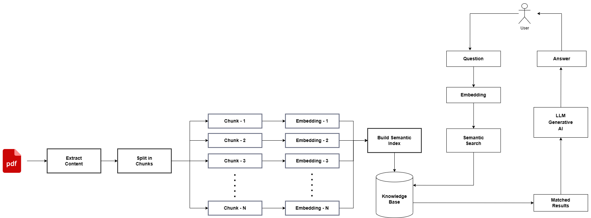

# Chat with your PDF📃

https://github.com/imakhilnaidu/Chat-with-PDF/assets/84142821/dc4981a2-432a-45ce-8da3-e3c79bc17411

<h4>✅ Technologies Used:</h4>

<li>Python</li>
<li>LangChain</li>
<li>OpenAI</li>
<li>FAISS</li>
<li>Streamlit</li>

<h4>✅ How it works?</h4>

  This is a python application it allows you to upload pdf, after uploading it will extract the text from that
  pdf and split the whole text into chunks, after that chunks will embedded to create vector database of 
  chunks using OpenAIEmbeddings.

  Now user can ask/chat with document by giving inputs that input will also get embedded same like how we done 
  previously. That input will got searched in vector database(chunks) and return chunks which are similar to
  user input and now that chunks are passed to the LLM to generate response

